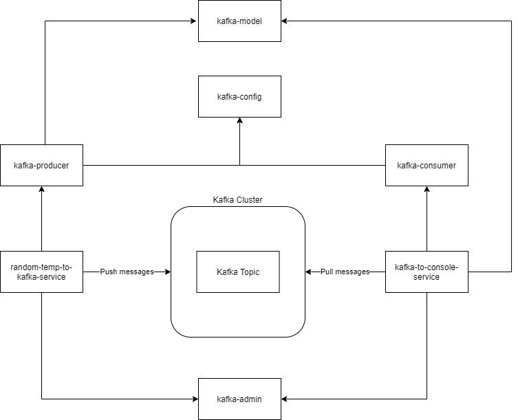

# Kafka Client

This project demonstrates producing and consuming kafka messages using Apache Avro.

It generates a random temperature every given time that simulates reading the value from an IOT device.
The value is then written on a Kafka topic and read by another service and written on the console.

## Architecture Diagram



## Requirements
- Java 11
- IntelliJ/Eclipse/Visual Studio Code (optional)
- Docker

## Docker compose files

This application depends on a Kafka cluster configured in the docker compose file.

Make sure to replace the mounted volume with valid paths:

```shell
volumes:
  - /Users/czetsuya/Documents/dev/volumes/zookeeper/log/version-2/:/var/lib/zookeeper/log/version-2
  - /Users/czetsuya/Documents/dev/volumes/zookeeper/data/version-2/:/var/lib/zookeeper/data/version-2
```

```shell
docker-compose -f common.yml -f kafka_cluster.yml up
```

## Running the Demo Application

You can import all the projects in IntelliJ and create a Run Configuration for these 2 projects:
- random-temp-to-kafka-service
- kafka-to-console-service

Or you can build and run the projects in the terminal using the maven command.

## Kafka GUI

For viewing the Kafka topic, you may download and use [KafkaTool](https://www.kafkatool.com/download.html).